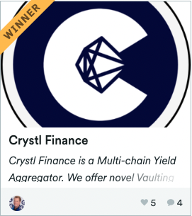

[Crystl Finance](https://polygon.crystl.finance/vaultsV3) is an award-winning, multi-chain vaulting platform. I was the lead on a team of 3 solidity developers, working in collaboration with the front-end team, the CEO and product manager, to build, test and deploy an improved version of the protocol's vaults, with some innovative features.
You can learn more about the protocol and the features we built by checking out the following devpost [submission](https://devpost.com/software/crystl-finance). This short youtube video in particular is great for demonstrating how our Ultra Farms differ from standard yield farm vaulting solutions:
<iframe width="560" height="315" src="https://www.youtube.com/embed/oKEYdlj0jpw" title="YouTube video player" frameborder="0" allow="accelerometer; autoplay; clipboard-write; encrypted-media; gyroscope; picture-in-picture" allowfullscreen></iframe>

For this work, we won a 2nd runner-up prize in the TRON Grand Hackathon 2022, and a runner-up prize in the Polygon BuidlIt Hackathon 2022.  

### Challenges
The major initial challenge was to figure out how to do multiple levels of vaulting, whilst still accurately tracking user shares of each compounded vault. This might seem trivial at first, but when you start to factor in that users could deposit and withdraw at different times, and in unpredictable ways, it becomes quite complex quite quickly. The way we solved this was with a lot of elbow grease, collaboration between myself and one other very smart solidity dev on the team, and going back to first principles in mathematics to figure out how it could be done.

A second challenge was to keep our main vault smart contract from becoming too big to deploy. Once we had everything working, we then had to do further work to reduce the size of our smart contract. We tackled this in a number of different ways - combing through the code to remove redundant variables or code, then extracting certain functions into externally deployed libraries, and finally using the optimiser to eventually bring the code down to the size that we needed it to be.

Another major challenge was finding a way to bring down the cost of deployment per vault. We did this through a combination of using proxy contracts, and also encoding certain variables in novel ways.

Finally, we had to ensure that this new set of smart contracts was secure and ready for production. This was not just a fork of battle-tested smart contract code, there was a lot of novel code, and we first had to satisfy ourselves that it was secure, and then get it through an audit process. We built our own suite of unit tests, first in javascript, and then converted them into typescript. We then experimented with Mythril to test the code. Finally we submitted it to Hashex for the audit - the preliminary audit report can be seen [here](./documents/Crystl-Vaults_preliminary-audit-report_1648559243967.pdf), and the final audit report can be seen [here](./documents/Crystl-Vaults_audit-report_1651814621605.pdf).

The repo for these vaults is unfortunately private, but on request I would be happy to share portions of the code with interested parties.