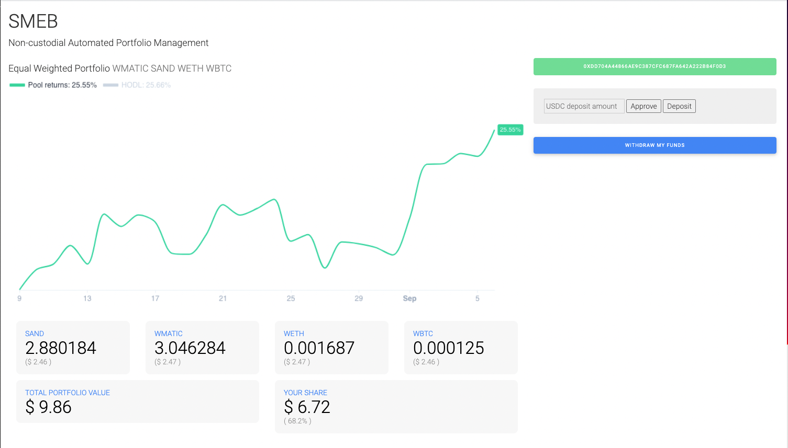

[OptyFi Yield Aggregator](https://app.opty.fi/) - OptyFi is etc

[Crystl Finance V3 Vaults](https://richjamo.github.io/portfolio/about/)

[SMEB Non-custodial Automated Portfolio Management Dapp](https://spheron.infura-ipfs.io/ipfs/QmUjegH2uJPHjYceU4SRtm6qrdQbommrfcLnE6jJbAro72/)

### Small tools built for my own DeFi activities:
[Farm Optimizer](https://richjamo.github.io/FarmOptimizer/) - a simple utility to check the value of your holdings in a particular liquidity pool
(source code can be found [here](https://github.com/RichJamo/FarmOptimizer))

[Farm Dashboard](https://richjamo.github.io/FarmDashboard/) - a simple utility to compare returns across different liquidity mining and yield farming options (under construction - source code can be found [here](https://github.com/RichJamo/FarmDashboard))

Built as part of a tutorial during my Solidity studies:
[Crypto Kitties](https://richjamo.github.io/CryptoKitties/) - inspired by the very succesful cryptokitties website, this was a project to learn about Dapp development generally, and about NFT's in particular.
